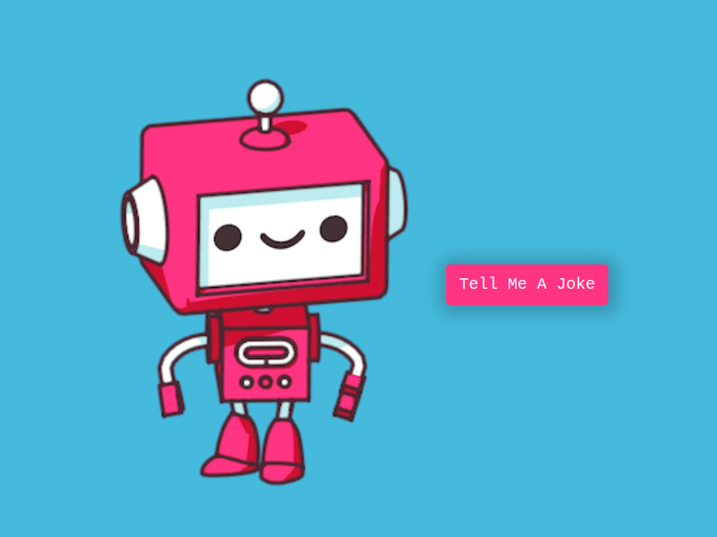

# advancedJS_Joke Teller: [LIVE DEMO](https://shcoobz.github.io/advancedJS_joke-teller/)

## Summary

advancedJS_Joke Teller provides a fun and interactive way to enjoy jokes with an animated text display synchronized with audio. It features a user-friendly interface that allows users to easily fetch and listen to jokes.

The core functionality includes:

- Fetching jokes from an external API.
- Displaying jokes with animated text synchronized with audio playback.

## Features

### Joke Fetching

Users can click the "Tell Me A Joke" button to fetch a random joke from the joke API.

### Animated Text Display

The fetched joke is displayed with animated text, providing a visually engaging experience synchronized with audio playback.

### Audio Playback

The joke is read aloud using text-to-speech technology, allowing users to listen to the joke.

### Additional Features

- Button disables during joke fetching to prevent multiple requests.
- Error handling for failed joke fetching.

## Technologies

- React: A JavaScript library for building user interfaces.
- JavaScript: The programming language used for the application logic.
- HTML/CSS: Markup and styling languages for structuring and designing the user interface.
- PropTypes: Library for type-checking React props for improved code reliability.
- API: Utilizes an external joke API for fetching jokes.
- VoiceRSS: Text-to-speech API for generating audio from text.

---

_Note: This document provides an overview of advancedJS_Joke-teller. For detailed instructions and more information, please refer to the source code documentation._

_This project is a conversion from an earlier version built with vanilla JavaScript and HTML, available [here](https://github.com/Shcoobz/basicJS_joke-teller/). This conversion integrates React to enhance UI reactivity and maintainability._
